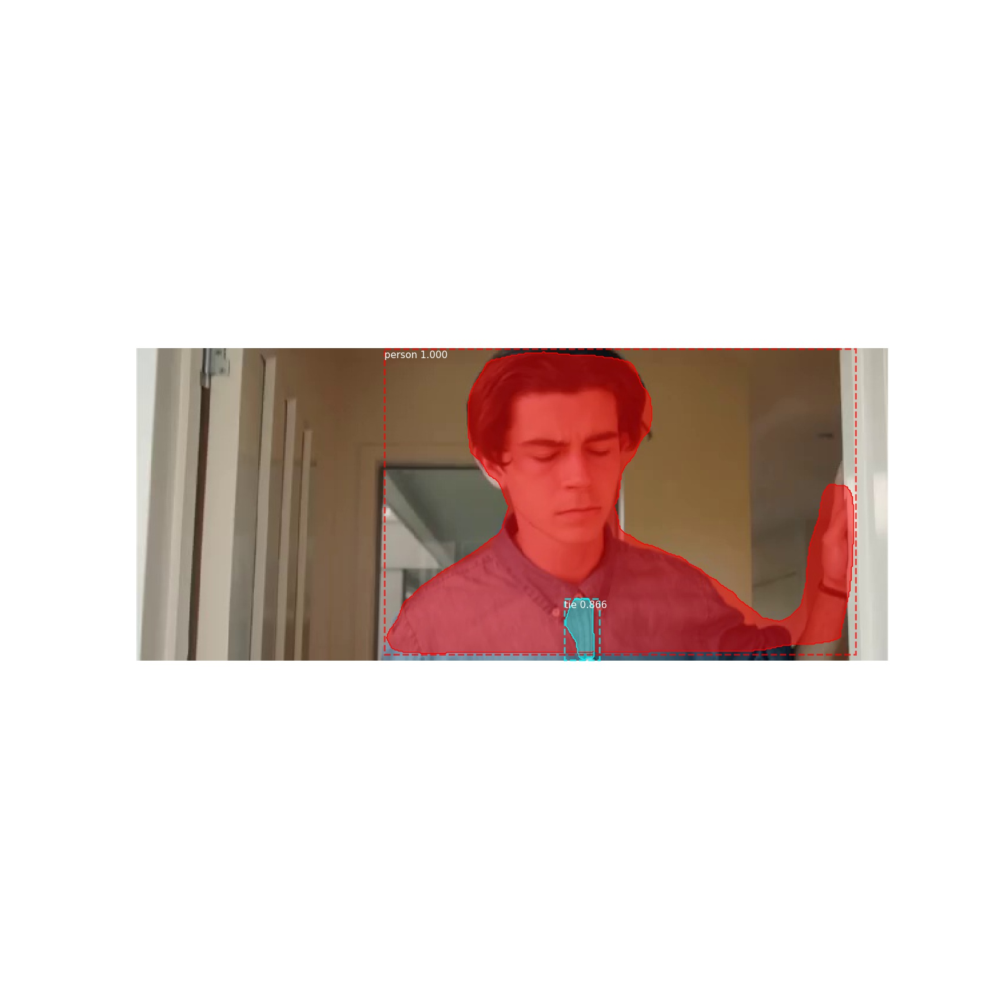
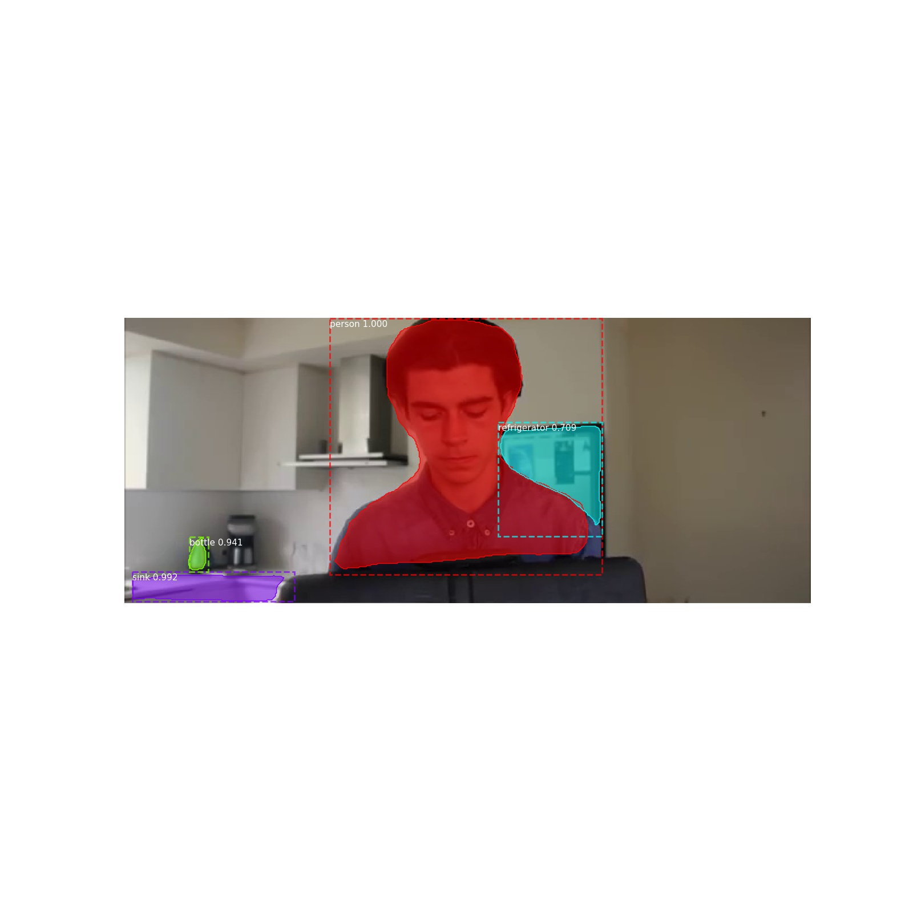
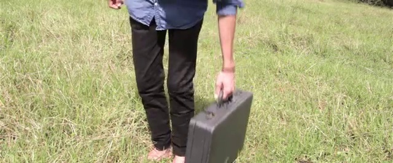
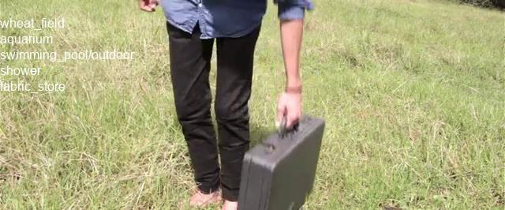
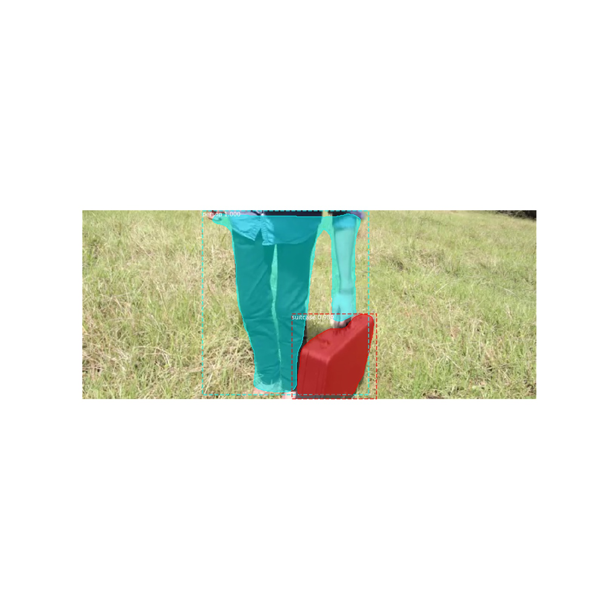

# Power Up Automation
> video-scene-inventory

Takes a video as input and detect scene changes. Analyze a scene image to automatically detect place (desert, nature, a room, etc.). Detect person and objects in scene image (show shapes and roi (region of interest).

## Overview

This is a command line tool that takes a video as input and shows information about:

- Scene change detection
- Setting – Where are we? (Image classifier telling where are we, what are seeing: desert, nature, a room, etc.)
- Exposition – Necessary information. Quick and Clever (Object detection and count: Person, Cars, Airplane, etc.)

## System Requirements

- Tested/Developed on Windows 10
- Python 3.6
- Python PIP (installed along with Python)
- Microsoft Visual C++ Build Tools for the COCO API... more info here: [https://github.com/philferriere/cocoapi](https://github.com/philferriere/cocoapi)

### Clone or download zip

Either do a `git clone` or download and extract the tool to a new directory (e.g. `video-scene-inventory`)

    git clone https://github.com/chok68/video-scene-inventory.git

### Create and activate virtual env

Inside the `video-scene-inventory` directory enter:

    python -m venv myenv && myenv\Scripts\activate

### Upgrade pip

You should consider upgrading Python Pip... 

    python -m pip install --upgrade pip

### Install Python requirements

    pip install -r requirements.txt
    pip install git+https://github.com/philferriere/cocoapi.git#subdirectory=PythonAPI

## Show usage

Issue `vsi.py -h` in a new console window to see the tool usage syntax.

    Show video scene inventory.

    positional arguments:
      video_filename  pass a video as input
      output_dirname  specify where to store output results
    
    optional arguments:
      -h, --help      show this help message and exit

## Examples

    vsi.py "data\videos\'The Jump' - Time Travel Short Film.mp4" outputs

This will take the `"data\videos\'The Jump' - Time Travel Short Film.mp4"` video file as input and will save the **Video Scene Inventory** results to the `"outputs\'The Jump' - Time Travel Short Film.mp4"` directory.

Please feel free to run the tool with other videos under the `data` directory!

### Results

#### Scene 2

##### Scene change detection

##### Setting – Where are we?

##### Exposition – Necessary information. Quick and Clever

#### Scene 19

##### Scene change detection

##### Setting – Where are we?

##### Exposition – Necessary information. Quick and Clever

#### Scene 22

##### Scene change detection

##### Setting – Where are we?

##### Exposition – Necessary information. Quick and Clever

## Dependencies (installed with Python Pip)

- tensorflow
- numpy
- scipy
- click
- tqdm
- opencv-python
- Pillow
- keras
- pandas
- h5py
- statistics
- matplotlib
- cython
- scikit-image
- imgaug
- IPython
